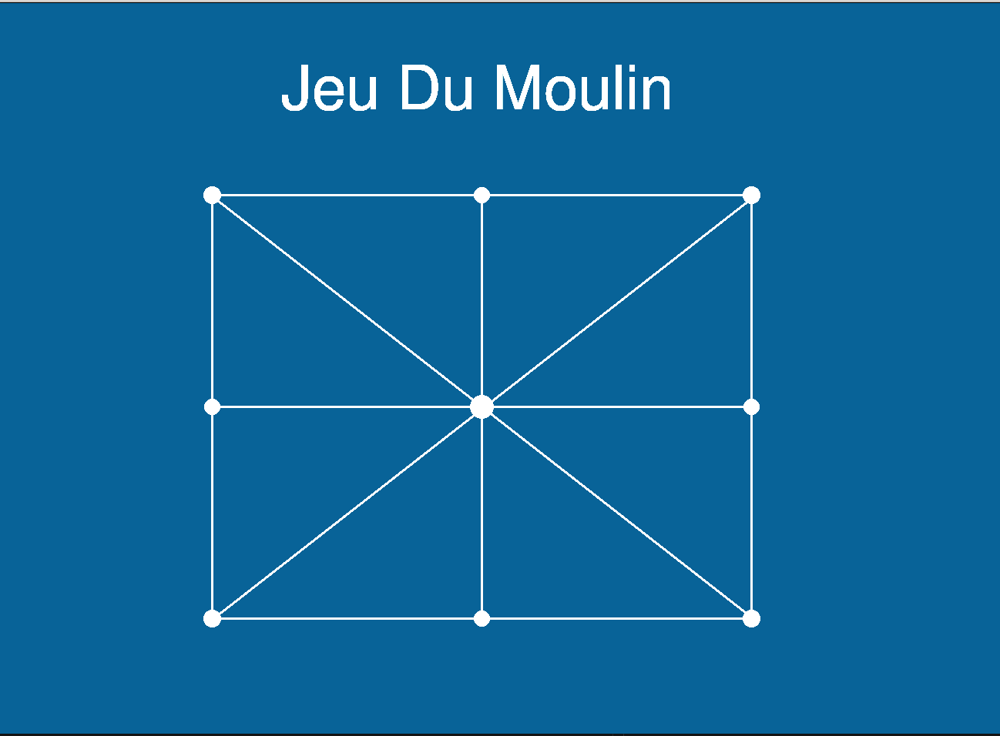
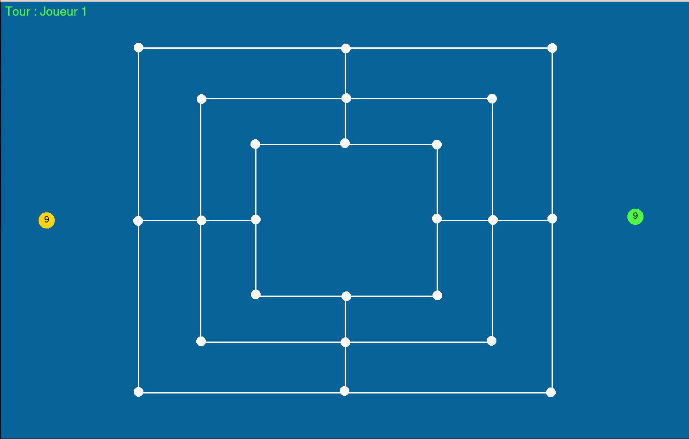
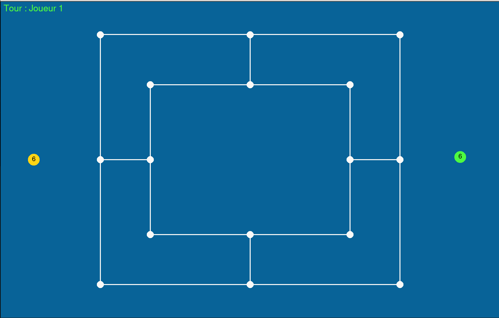
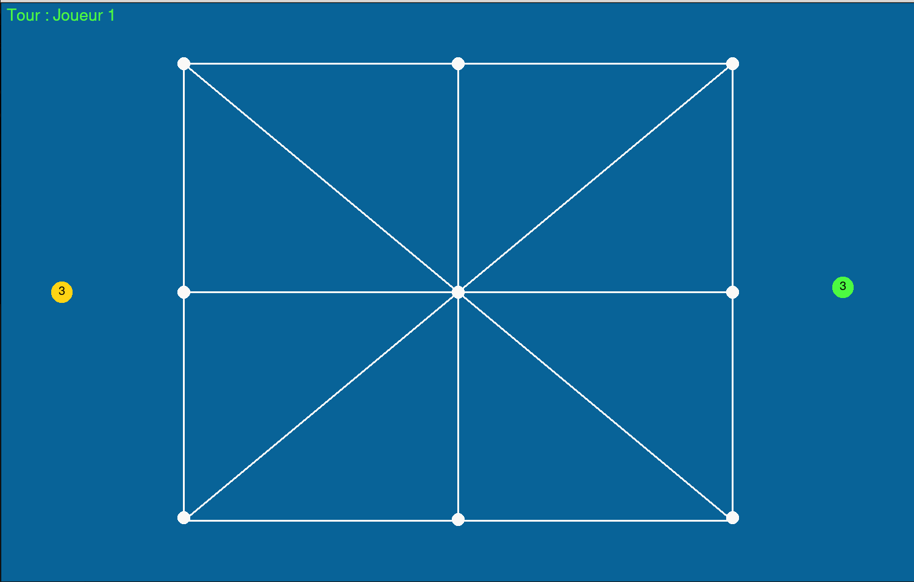
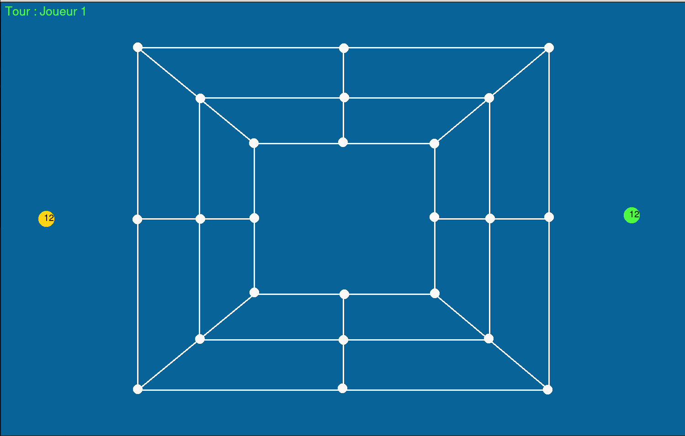
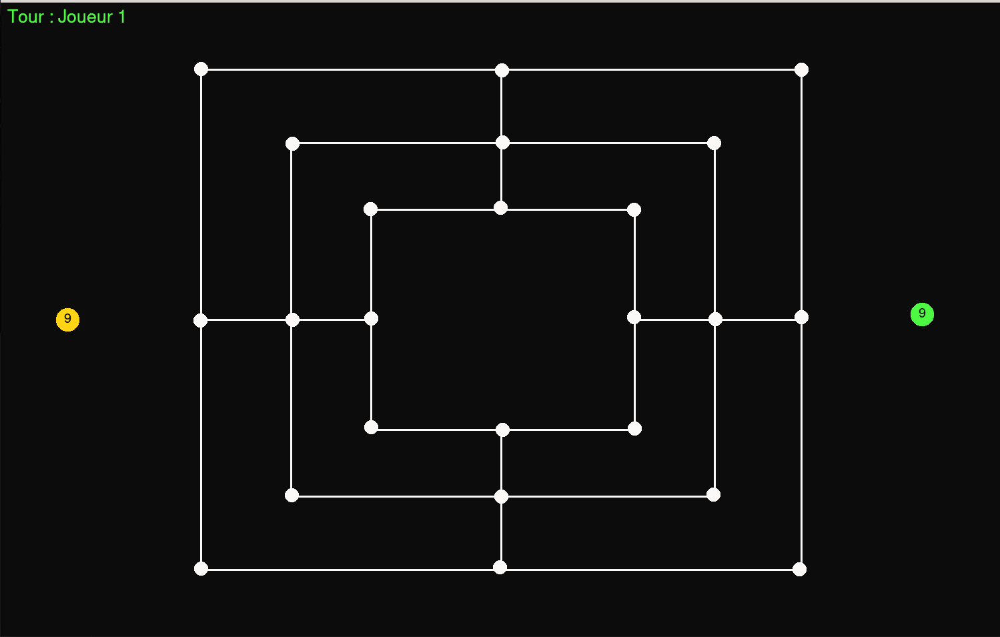

## **Projet de Fin de semestre 1 : L1 Maths-Info TP-12**

Vinesh RENGASSAMY -
Nelson LUU -
Hassan HAKMAWI

<span style="font-size: 400%">Jeu Du Moulin</span>
***
<br>



# Introduction

## Objectif :

&ensp; Implémenter La jeu du mouulin (_nine men morris_) à l'aide Python3 et fltk. Ce jeu se dispute sur un plateau où figurent des lignes droites et des intersections. Les actions des joueurs consistent à placer ou à déplacer leurs pions aux intersections du plateau, en essayant de former des alignements de trois pions juxtaposés (ou « moulins »).

<br>

# **Tableau Des Matières**

## &ensp;**I. Guide d'utilisation du programme**
&emsp; &emsp; **A. Lancement du jeu**

&emsp; &emsp; **B. Paramètres**

&emsp; &emsp; **C. Utilisation du jeu**

## &ensp;**II. Documentation Technique**
&emsp; &emsp; **A. La structure du projet**

&emsp; &emsp; **B. Déroulement du développement**

<br>


# **I. Manuel d'utilisation**
## **A. Lancement du jeu**

&ensp; La fichier `main.py` est la programme principale qui l'importe tous les autres programmes. Pour lancer la jeu on utilise python3.

```
python3 main.py
```
Par defaut, la programme se lance avec la plateau variant 9 pions et la theme standard.



## **B. Paramètres**

&ensp; On peut jouer au diffèrents variant en passant la nombre de pions via Terminale.

```
python3 main.py 6
```
**Variant à 6 pions**


```
python3 main.py 3
```
**Variant à 3 pions**


**Variant à 12 pions**
```
python3 main.py 12
```


<br>
Et auusi, on peut changer en mode sombre, grâce à l'argument "dark".

```
python main.py 9 dark
```


<br>

## **C. Utilisation du jeu**

Il y a 2 partie dans le jeu, 1er poser les pions puis 2ème déplacer les pions.<br>
Pour poser, il suffit de appuyer dans les intersections vides. Et pour déplacer, il faut appuyer dans une des dèja posé, puis appuyer 2ème dans une intersection vide.
La joueur peut déplacer uniquement dans les intersection voisin. Sauf si, il reste que 3 pions pour un joueur dans la variant 9 et 12 pions.
La partié sera gagnée, si un des joueur est bloqué ou il rest que 2 ou 1 pions pour un joueur.

Une autre foncionnalités est de sauvegarder la parie dans une fichier json. Pour cela il suffit d'appuyer 's' pendant la jeu, puis donner la nom de fichier via terminale. 

*Note : On ne peut pas sauvergarder la partie si un des joueur doit enlèver la pion d'adversaire*.

Pour charger la partie sauvergarder il faut executer la programme avec la nom du fichier.
```
python3 main.py maPartie.json
```
*Note : Il faut donner la nom fichier avec l'extenstion .json*

<br>

# **II. Documentation Technique**

Cette documentation technique contient les informations nécessaire pour la comprénsion du code.

## **A. La structure du projet**

La programme du jeu est repartie en 6 fichier python :
```
config.py
plateau.py
joueur.py
parsing.py
interface.py
main.py

+ fltk.py
```

### *config.py* 
Cette fichier contient tous les constantes du jeu, comme la taille du écran etc ...

### *plateau.py*

La plateau est représenté sous la forme 2D liste. chaque intersections a une indice un valeur, soit 0 place vide, 1 place occupé par joueur 1 et 2 palce occupé par joueur 2.


```
     (0,0)--------------(0,1)-------------(0,2)
      |                    |                |
      |     (1,0)-------(1,1)-------(1,2)   |
      |       |           |           |     |
      |       |  (2,0)--(2,1)--(2,2)  |     |
      |       |    |             |    |     |
      |       |    |             |    |     |
    (3,0)--(3,1)--(3,2)       (3,3)--(3,4)--(3,5)
      |       |    |             |    |     |
      |       |    |             |    |     |
      |       |  (4,0)--(4,1)--(4,2)  |     |
      |       |           |           |     |
      |      (5,0)------(5,1)-------(5,2)   |
      |                   |                 |
     (6,0)--------------(6,1)-------------(6,2)
```
plateau au variant 9 pions

Cette programme contient, les classes de plateau. La classe ```Plateau()``` est une classe parent contient les méthodes qu'est commun pour les type de variant. Puis cette classe est héreditée au different classes d'enfants. <br> chaque classe enfants corresponds chaque variant du plateau. Et chaque classes enfants contient sa propre methode pour trouver la moulin.

<br>

### *joueur.py*

Cette programme contient les classes 

`Joueur()` : represent les joueurs (joueur 1 et 2).<br>
`Jeton()` : represent le pion.

Les pions sont associés au joueurs dans une dictionaire.
<br>

### *parsing.py*

Cette programme contient la fonction `parse()` pour analyer les inputs utilisateur. et les classes `Sauvegarder()` et `chargerPartie()` pour sauvegarder et charger la partie.
<br>

### *interface.py*

Cette programme contient tous les aspects graphique comme les plateaux et l'animation de l'intro.
<br>

## **B. Déroulement du développement**

Nous avons decidé de repartir la projet en 4 tâches majeurs.
- Tâche n°1 : créations les class plateaux et ces méthodes. Et créations des constantes.
- Tâche n°2 : création la classe joueur et jeton avec la programe main.
- Tâche n°3 : créations des plateaux dans fltk et parsing les inputs utilisateurs.
- Tâche n°4 : tous les choses optionelles comme sauvegarder la partie.

Au début, nous avons commencé par implimenter uniquement pour la plateau de 9 variants, puis nous avons decidé de faire pour les restes du variants.Dans la version début du `plateau.py`, on a fait une seul classe pour détecter les moulin de tous les type de manière complet. C'est à dire verifier tous les lignes et les colonnes sans prendre compte la dernière clic du joueur. Mais cela poser des problèmes comme detecte plus fois la même moulin. Donc on a pris la derniere clic joueur et verifie uniquement dans cette ligne et colonne. Cela nous oblige à faire des classe enfants pour chaque type de variant avec sa propre méthhode moulin.<br>
En raison de l'état santé (Rhume) de nos membres, on a pu venir dans certaine TP , donc on est obligé de rattraper pendant les vacances en distance (communiquation par discord).Cela ralentiser notre avancement. En aussi à cause de manque de temps et les partielles dans autres matière, on a abandonné certain fonctionnalité optionelle, expliquer ci-dessous.

### Fonctionnalité abandonnées
Implimenter un bot (IA) qui permet de jouer contre la joueur. cette bot utilise l'algorithme **MinMax** pour choisir la meilleur coup et **AlphaBeta pruning** pour optimiser.

<br>

*pour faciliter la travail au distance et simplfier la développement Nous avons utilisé git et github.*

